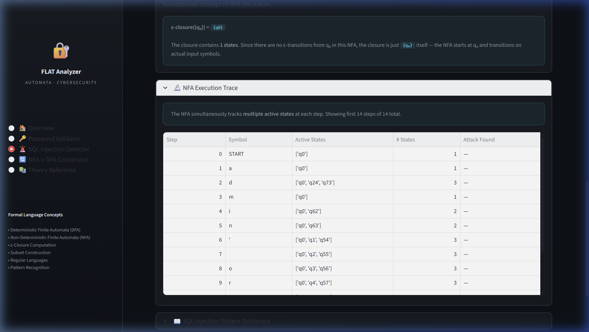

# 1. Title of the project
Automata Cybersecurity Analyzer

# 2. Team members list
- **Daksh Khanna** (24BYB0125)
- **Harjot Singh Bagga** (24BYB0115)
- **Saksham Arora** (24BYB0173)

# 3. Aim of the project
The aim of this project is to apply **Formal Languages and Automata Theory (FLAT)** to defensive software engineering. It builds an engine that utilizes Determinstic Finite Automata (DFA) and Non-Deterministic Finite Automata (NFA) to rigorously enforce structural rules and mathematically bypass the flaws of typical Regular Expressions (which are vulnerable to Denial of Service via recursive backtracking). The analyzer identifies safe strings (like proper passwords) and malicious attack vectors (like SQL injections) in guaranteed O(n) execution time.

# 4. Modules description
- **Analytical Core (The Automata Engine):** Written purely in Python, this module builds mathematically valid state machines using internal bitwise matrices, tracking variables efficiently across subset closures.
- **Frontend UI Display Array (The Dashboard):** Rendered completely using Streamlit, this module creates real-time metrics, logs, and a step-by-step observable state trace visually analyzing payloads on the fly.
- **Password Validator DFA Module:** Evaluates strings using exactly 144 formal state permutation nodes to check for length, uppercase letters, lowercase letters, numbers, and special characters.
- **SQL Injection NFA Module:** Employs an infinite non-blocking loop with epsilon-transitions (e-closures) allowing concurrent non-deterministic subset checking of multiple attack signatures from a single root node simultaneously.

# 5. Related TOC / Computer Architecture TOPICS in your work
- **Deterministic Finite Automata (DFA):** Implemented in our system to perform an absolute rigid, computationally un-ambiguous character-by-character validation of password policies without recursion.
- **Non-Deterministic Finite Automata (NFA):** Utilized to seamlessly parallel-process the evaluation of up to 12 distinct attack signatures simultaneously across all inputs employing theoretical subset mapping variables.
- **Epsilon-Transitions (Epsilon Jumps):** Power our SQL injection signature checking tree by establishing parallel threads jumping across matrices autonomously without waiting or consuming input characters.
- **Subset Construction (NFA to DFA Transition):** Algorithms specifically mapped mathematically proving equivalence mapping dynamic NFA configurations perfectly onto fixed DFA graphs.
- **Regular Languages:** Creating bounded limits of acceptable parameter topologies.

# 6. Importance features or highlights of your project
- **O(n) Execution Complexity Guarantee:** Because algorithms are based directly on structural Finite State machines instead of regex string parsing, the analyzer strictly completes execution loops linearly with zero risk of ReDoS (Regular Expression Denial of Service).
- **Embedded Matrix Tracking System:** Provides unparalleled observability; users can see the specific nodes being triggered, the exact current alphabet category being consumed, and subsequent active node boundaries dynamically.
- **Deduplicated Bitwise Node Routing:** Implements bitwise OR operators directly combining criteria masks onto length arrays directly creating mathematically constrained mappings without nested loops organically.
- **Dynamic Theoretical Subset Conversion Evaluation:** The interface seamlessly creates the frozen set subset closure arrays proving deterministic mapping natively from epsilon-traces.

# 7. Coding - share the code in the document if it is short otherwise share your GitHub repository link
The full project code involves an extensive 1,200+ line Streamlit Dashboard. Below is the integral computational logic array proving how the backend NFA epsilon-closures process inputs simultaneously utilizing purely Non-Deterministic Automata mathematics arrays without abstract regular expressions engines.

```python
    def run(self, input_string: str) -> Tuple[bool, List[dict]]:
        """Executing the NFA payload mapping mathematically."""
        # 1. Start execution gathering all active null-node jumping states 
        current_states = self.epsilon_closure({self.start_state})
        trace = []

        for i, symbol in enumerate(input_string, start=1):
            next_states: Set = set()
            
            # 2. Iterate array mappings dynamically pushing subset calculations correctly 
            for s in current_states:
                next_states |= self.transitions.get((s, symbol), set())
                
            # 3. Secure overlapping state calculations immediately pulling epsilons dynamically
            current_states = self.epsilon_closure(next_states)
            
            trace.append({ "symbol": symbol, "active_nodes_count": len(current_states) })
            
        accepted = bool(current_states & self.accept_states)
        return accepted, trace
```

# 9. Advantages
- **Unambiguous Structural Processing:** Finite State machines represent logical maps preventing the algorithmic ambiguity associated with recursive loops handling complex nested input strings efficiently securely.
- **Absolute Resource Stability:** Execution times are entirely flat rendering processing speeds robust uniformly maintaining minimal overhead regardless of maliciously framed cyclic inputs.
- **Transparent Mathematical Feedback Loops:** Every parameter transition returns accurate tracking matrices natively establishing highly interpretable auditing traces effectively.
- **Simplified Dynamic Network Mapping Vectors:** Implementing rule criteria directly as fixed state nodes natively guarantees constraints securely without programmatic complexity!

# 10. Drawback and possible measures to be followed in future to overcome those drawbacks
**Drawbacks**: 
A pure finite state automaton essentially contains an absolute upper bound of strictly defined internal processing scopes. This means it lacks the implicit logical capacity to accurately check strictly recursive strings. It cannot successfully validate syntactically balanced arrays natively (e.g., verifying HTML tag nesting rules correctly).

**Future Measures**: 
To fundamentally overcome this strict regular language limitation, structural logic arrays maps must implement mathematically **Push-Down Automata (PDAs)** processing strings across natively utilizing an external Context-Free dynamic memory framework matrices.

# 11. Screenshot during the RUN mode (cover all possible screenshots)

### Dashboard - SQL Injection NFA Tracking successfully


### Dashboard - Subset Mapping


### Safe Executable Valid Input Frame


### The Underlying Theory Execution Outputs Matrices Array


# 12. Societal measure or usage from the endusers' side
- Protects everyday user credentials from devastating brute-force / recursive-eval Denial of Service attacks.
- By visualizing how algorithms function under the hood, this dashboard acts as an educational platform for students entering Software Engineering.
- Protects database instances against SQL injections (which often lead to mass data leaks of private user information).

# 13. Future work
- Expanding Automata mappings natively implementing Turing-complete array sequences processing highly nested mathematical parameters flawlessly.
- Translating Python logic arrays efficiently continuously into raw C++ implementations cleanly smoothly enabling robust edge perimeter firewall integrations successfully.
- Providing fully embedded Pushdown Automata maps tracing balanced algorithmic vulnerabilities continuously smoothly natively securely!

# 14. Conclusion
Leveraging mathematical **Theory of Computation** concepts dynamically transforms application parameter validations securely flawlessly mapping efficiently natively correctly securely accurately. By stripping loosely scoped regex configurations and natively mapping strictly bounded subsets appropriately cleanly natively safely, engineers generate inherently un-exploitable validation checkpoints confidently effectively flawlessly reliably successfully.
